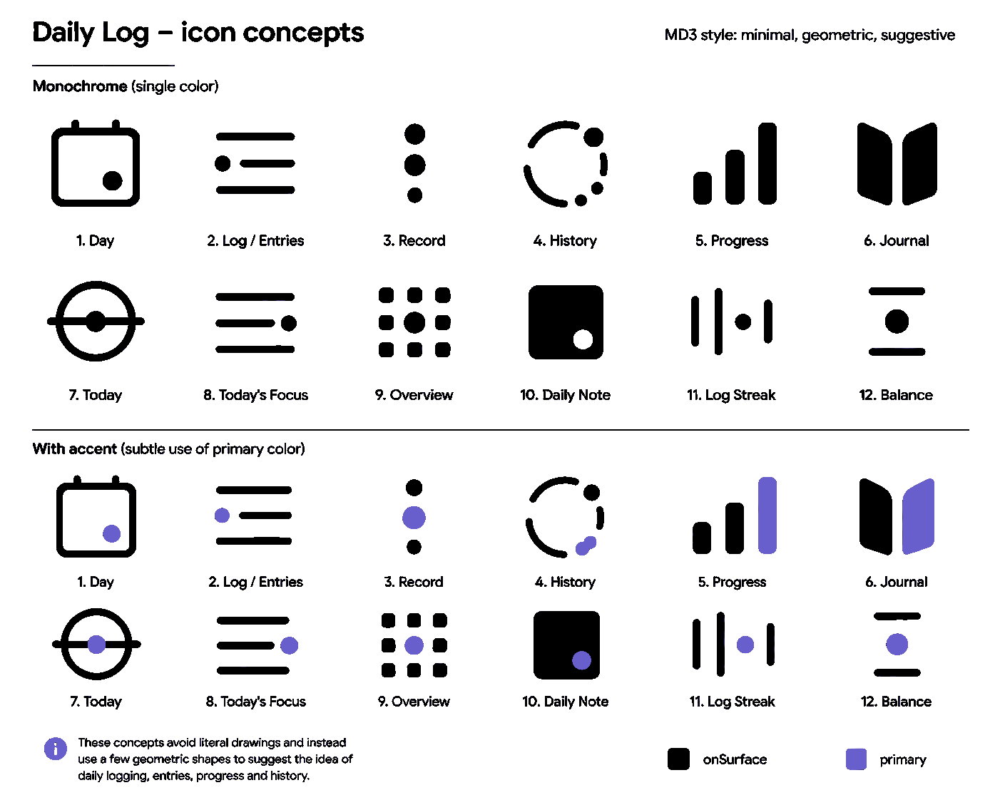

# Miscellaneous icon design notes

I wrote Dayfile's predecessor, Daily Log, in 2012 but it never got to a released state. It used the public domain accessories-text-editor.svg icon from the Tango Icon Library:

For the new version I wanted something a bit less generically text-editor. Unfortunately my imagination and artistic abilities are both limited. I asked ChatGPT to come up with a few suggestions but everything felt incredibly generic. I didn't persevere long (free ChatGPT really doesn't like generating images) but the more or less final set of ideas can be seen here:

(The original was much higher quality and used anti-aliased text. I've modified this copy to shrink the file size; it's still readable and the icon designs are still intact, but it looks a bit ugly and this isn't ChatGPT's fault.)

At some point during our discussions there was some idea of sun or moon to represent the daily nature of the app. In the end I was toying with some sort of static Lissajous-ish curves just as a general abstract icon, which suddenly made me think of a sort of square wave representing "data" orbiting a sun representing "day/daily". This doesn't really make that much sense, but it kind of appealed to me and it felt within my artistic capabilities and fitted within the vague "vector symbol" style which seems to go with modern Android apps.

The archive folder here contains some historical noodlings as I tried to get the icon to work. In the end I asked ChatGPT to write me some Python code to generate the "3D projected" square wave, which you can see in the code folder. I tweaked the parameters around a bit and eventually traced over one of those outputs to get a vector wave which I combined with a sun (my artistic talents do extend as far as a solid colour circle) and hacked about to get the layering correct.

I dithered about the colours and you can see some experimentation in the archive folder. (These were originally 1024x1024 bitmap exports, re-coloured in gimp for convenience. I've rescaled them to 128x128 here, as you can still browse them and see the idea without it wasting so much space. The final application of the chosen colours was done by editing them into the SVG versions, not by tracing the recoloured bitmaps.) In my head the 2012 app icon had an orange highlight - which you can see it actually doesn't, although maybe the brown-ish pencil does give an orange tint on certain screens - which I wanted to carry forward into the successor app. This influenced the choice of the orange square wave around the yellow sun.

At some point I decided to re-generate the square wave so it was less busy and had fewer transitions at the left and right edges, where the "perspective compression" makes things look a bit jaggy/complex.

I am moderately satisfied with the result. It isn't terribly original, it doesn't fit the app amazingly well, but it feels OK and not too shoddy or garish. It's growing on me.

The three `app-icon-3-fg.svg`, `app-icon-bg.svg` and `app-icon-3-mono.svg` files are hopefully the correct layers required by Android Studio's icon tool. I used a 95% scaling factor on all three when importing to add a bit more blank space around the edges of the safe area. `app-icon-colour.svg` is a composite of `app-icon-3-fg.svg` and `app-icon-bg.svg`. `feature-graphic.svg` is the same as `app-icon-colour.svg` but with the background sized differently.
